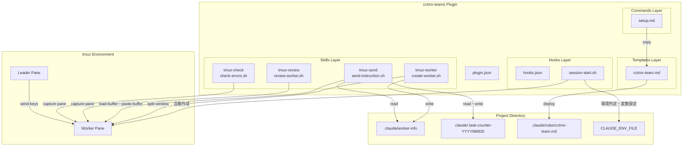
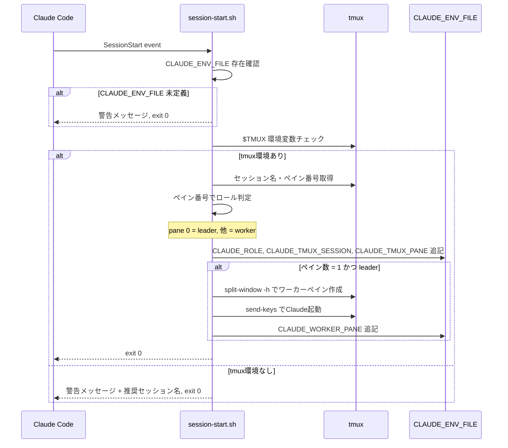
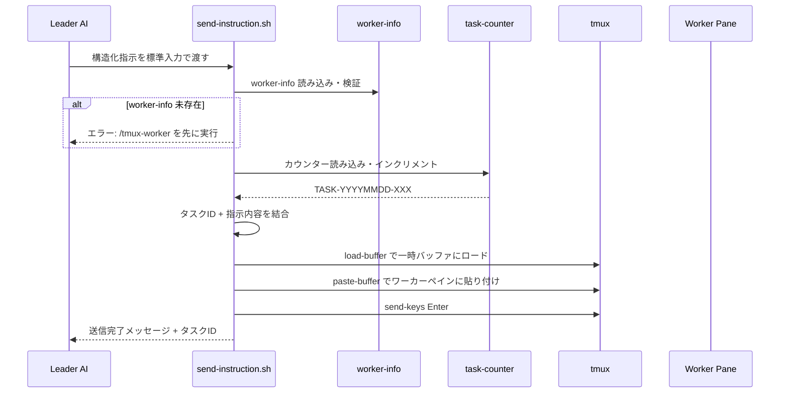
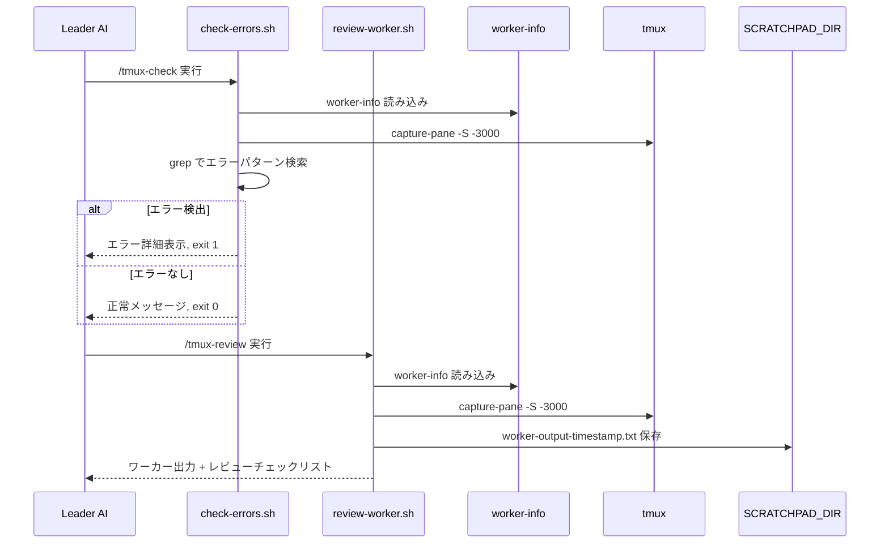
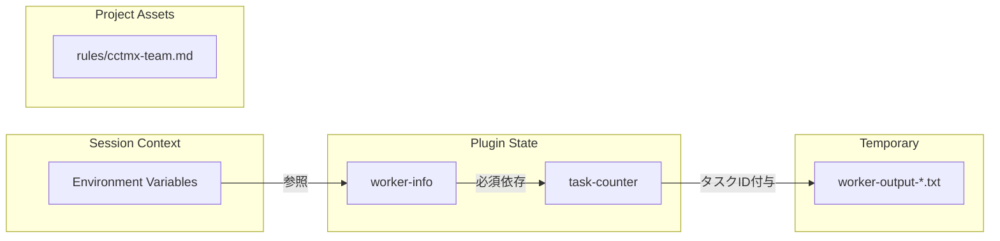

# Design Document: plugin-ification

## Overview

**Purpose**: cctmx-teamsのtmuxベースのリーダー・ワーカーパターンを、再利用可能なClaude Codeプラグイン v0.1.0 として実装する。ユーザーが任意のプロジェクトでGitHubリポジトリからクローンし、プラグイン登録するだけで利用可能にする。

**Users**: Claude Codeでtmuxベースの並列AI開発を行いたい開発者。リーダーAIがタスクを分解・委譲し、ワーカーAIが並行実装するワークフローを実現する。

**Impact**: 個別のスクリプト群から統合プラグインへの移行により、配布・インストール・バージョン管理が標準化され、エコシステムへの統合が実現する。

### Goals

- 4つのスキル（tmux-worker, tmux-send, tmux-review, tmux-check）をポータブルに実装
- setupコマンドでワンステップ導入を実現
- SessionStart Hookで自動環境判定を維持
- 全スクリプトで `${CLAUDE_PLUGIN_ROOT}` ベースのパス参照を使用
- 既存テスト全合格を維持

### Non-Goals

- PreToolUse Hook（ワーカー禁止操作検知）— Phase 2
- Agents（task-decomposer, code-reviewer）— Phase 2以降
- 複数ワーカーサポート — Phase 2以降
- 設定ファイル（`.claude/cctmx-teams.local.md`）— Phase 2以降

## Architecture

### Architecture Pattern & Boundary Map



**Architecture Integration**:
- **Selected pattern**: Claude Codeプラグイン標準構造（Skills + Hooks + Commands + Templates）。プラグイン仕様に直接マッピング可能な構成を採用。
- **Domain boundaries**: プラグインコード（`${CLAUDE_PLUGIN_ROOT}` 配下、読み取り専用）とプロジェクトデータ（`${CLAUDE_PROJECT_DIR}/.claude/` 配下、読み書き可能）を明確に分離。
- **Adopted patterns**: tmuxの `send-keys` / `capture-pane` / `load-buffer` / `paste-buffer` によるプロセス間通信。ファイルベースの状態共有（`worker-info`, `task-counter`）。
- **Steering compliance**: `set -euo pipefail`、shellcheck準拠、`${CLAUDE_PLUGIN_ROOT}` ベースのパス参照を全スクリプトで徹底。

### Technology Stack

| Layer | Choice / Version | Role in Feature | Notes |
|-------|------------------|-----------------|-------|
| Script Runtime | Bash 4.x+ | 全スクリプト実行 | `set -euo pipefail` 必須 |
| Process Management | tmux 3.x+ | ペイン管理、AI間通信 | send-keys, capture-pane, load-buffer |
| Plugin Host | Claude Code | プラグインの読み込み・実行 | 環境変数の自動設定 |
| Quality Tool | shellcheck | 静的解析 | 全警告解消 |
| Quality Tool | jq | JSON検証 | plugin.json等のバリデーション |
| Quality Tool | markdownlint | Markdownフォーマット統一 | MD024:off, MD041:off, MD033:br/details/summary許可 |

## System Flows

### SessionStart Hook フロー



### タスク送信フロー (tmux-send)



### レビュー・エラー検知フロー



## Requirements Traceability

| Requirement | Summary | Components | Flows |
|-------------|---------|------------|-------|
| 1.1-1.5 | プラグイン構造の準拠 | plugin.json, ディレクトリ構成全体 | - |
| 2.1 | tmux-worker スキル | create-worker.sh, SKILL.md | - |
| 2.2 | tmux-send スキル | send-instruction.sh, SKILL.md | タスク送信フロー |
| 2.3 | worker-info 未存在時エラー | send-instruction.sh, review-worker.sh, check-errors.sh | - |
| 2.4 | tmux-review スキル | review-worker.sh, SKILL.md | レビュー・エラー検知フロー |
| 2.5 | tmux-check スキル | check-errors.sh, SKILL.md | レビュー・エラー検知フロー |
| 2.6 | スキル構成規約 | 全 SKILL.md + scripts/ | - |
| 3.1-3.4 | setupコマンド | commands/setup.md | - |
| 4.1-4.5 | SessionStart Hook | hooks/hooks.json, session-start.sh | SessionStart Hookフロー |
| 5.1-5.5 | テンプレート提供 | templates/cctmx-team.md | - |
| 6.1-6.3 | ポータビリティ保証 | 全スクリプト | - |
| 7.1-7.7 | 品質保証とテスト | tests/run-tests.sh | - |
| 8.1-8.9 | ドキュメント・インストール | README.md, LICENSE, 各SKILL.md | - |
| 9.1-9.7 | バージョン管理・リリース | plugin.json, CHANGELOG.md | - |

## Components and Interfaces

| Component | Domain/Layer | Intent | Req Coverage | Key Dependencies | Contracts |
|-----------|--------------|--------|--------------|------------------|-----------|
| plugin.json | Config | プラグインメタデータ定義 | 1.1, 9.1, 9.2 | なし | - |
| create-worker.sh | Skills/tmux-worker | ワーカーペイン作成 | 2.1, 2.6, 6.1-6.3 | tmux (P0) | State |
| send-instruction.sh | Skills/tmux-send | 構造化指示送信 | 2.2, 2.3, 2.6, 6.1-6.3 | tmux (P0), worker-info (P0) | State |
| review-worker.sh | Skills/tmux-review | ワーカー出力レビュー | 2.3, 2.4, 2.6, 6.1-6.3 | tmux (P0), worker-info (P0), SCRATCHPAD_DIR (P1) | - |
| check-errors.sh | Skills/tmux-check | エラーパターン検索 | 2.3, 2.5, 2.6, 6.1-6.3 | tmux (P0), worker-info (P0) | - |
| setup.md | Commands | プラグイン初期設定 | 3.1-3.4 | templates/cctmx-team.md (P0) | - |
| session-start.sh | Hooks | 自動環境判定 | 4.1-4.5, 6.1-6.3 | tmux (P1), CLAUDE_ENV_FILE (P0) | State |
| cctmx-team.md | Templates | リーダー・ワーカーガイド | 5.1-5.5 | なし | - |
| run-tests.sh | Testing | 自動テスト | 7.1-7.7 | shellcheck (P2), jq (P1) | - |
| README.md | Documentation | ユーザードキュメント | 8.1-8.7 | なし | - |
| CHANGELOG.md | Documentation | 変更履歴 | 9.3-9.5 | なし | - |

### Skills Layer

#### create-worker.sh

| Field | Detail |
|-------|--------|
| Intent | リーダーペインから新しいワーカーペインを作成し、Claude Codeを起動する |
| Requirements | 2.1, 2.6, 6.1-6.3 |

**Responsibilities & Constraints**
- tmux環境変数（`CLAUDE_TMUX_SESSION`, `CLAUDE_TMUX_PANE`）の検証
- `tmux split-window -h` によるワーカーペイン作成
- ワーカーペインでのプロジェクトディレクトリ移動とClaude起動
- `worker-info` ファイルへのペイン情報書き込み

**Dependencies**
- Inbound: Leader AI — スキル実行トリガー
- External: tmux — split-window, list-panes, send-keys (P0)
- External: CLAUDE_TMUX_SESSION, CLAUDE_TMUX_PANE — 環境変数 (P0)

##### State Management

- **State model**: `${CLAUDE_PROJECT_DIR}/.claude/worker-info` — Shell export文形式
- **Persistence**: ファイルベース、セッション間で永続
- **Concurrency**: 単一プロセスでの実行を前提

**worker-info フォーマット**:
```bash
export CLAUDE_WORKER_PANE=<window>.<pane>
export CLAUDE_WORKER_SESSION=<session-name>
```

#### send-instruction.sh

| Field | Detail |
|-------|--------|
| Intent | リーダーからワーカーへの構造化指示送信とタスクID自動採番 |
| Requirements | 2.2, 2.3, 2.6, 6.1-6.3 |

**Responsibilities & Constraints**
- worker-info の読み込みと検証（未存在時はエラー終了）
- タスクIDの自動採番（日付ベース `TASK-YYYYMMDD-XXX`）
- 標準入力からの指示内容読み込み（空の場合はエラー）
- `tmux load-buffer` + `paste-buffer` による指示テキスト送信
- `tmux send-keys Enter` による実行
- 当日以外の古いカウンターファイル（`.task-counter-*`）の自動削除

**Dependencies**
- Inbound: Leader AI — 構造化指示テキスト（stdin）
- Outbound: tmux — load-buffer, paste-buffer, send-keys (P0)
- External: worker-info — ペイン情報（P0、必須）

##### State Management

- **State model**: カウンターファイル `${CLAUDE_PROJECT_DIR}/.claude/.task-counter-YYYYMMDD`（整数テキスト1行）
- **Persistence**: ファイルベース、日付単位でリセット（翌日は001から再開）
- **Cleanup**: 実行時に当日以外の `.task-counter-*` ファイルを自動削除（肥大化防止）
- **Concurrency**: 単一プロセスでの実行を前提（排他制御なし）

**タスクID生成ルール**:
```
TASK-20260206-001  # 当日1件目
TASK-20260206-002  # 当日2件目
TASK-20260207-001  # 翌日は001からリセット
```

#### review-worker.sh

| Field | Detail |
|-------|--------|
| Intent | ワーカーペインの出力をキャプチャし、レビューチェックリストとともに表示する |
| Requirements | 2.3, 2.4, 2.6, 6.1-6.3 |

**Responsibilities & Constraints**
- worker-info の読み込みと検証（未存在時はエラー終了）
- `tmux capture-pane -S -3000` で過去3000行をキャプチャ
- `${SCRATCHPAD_DIR}/worker-output-<timestamp>.txt` に一時保存
- 標準出力にワーカー出力を表示
- レビューチェックリスト（共通/機能追加/バグ修正/リファクタリング）を提示

**Dependencies**
- External: tmux — capture-pane (P0)
- External: worker-info — ペイン情報 (P0)
- External: SCRATCHPAD_DIR — 一時ファイル保存先 (P1)

#### check-errors.sh

| Field | Detail |
|-------|--------|
| Intent | ワーカーペインの出力からエラーパターンを検索し、結果を報告する |
| Requirements | 2.3, 2.5, 2.6, 6.1-6.3 |

**Responsibilities & Constraints**
- worker-info の読み込みと検証（未存在時はエラー終了）
- `tmux capture-pane -S -3000` で過去3000行をキャプチャ
- `grep -iE "(error|エラー|失敗|exception|fatal)"` でエラーパターン検索
- エラー検出時: exit 1 + エラー詳細表示
- エラーなし時: exit 0 + 正常メッセージ表示

**Dependencies**
- External: tmux — capture-pane (P0)
- External: worker-info — ペイン情報 (P0)

**エラー検知パターン**:
| パターン | 対象 |
|----------|------|
| `error` | 英語エラーメッセージ |
| `エラー` | 日本語エラーメッセージ |
| `失敗` | 日本語失敗メッセージ |
| `exception` | 例外メッセージ |
| `fatal` | 致命的エラー |

### Hooks Layer

#### session-start.sh

| Field | Detail |
|-------|--------|
| Intent | Claude Code起動時のtmux環境自動判定と環境変数設定 |
| Requirements | 4.1-4.5, 6.1-6.3 |

**Responsibilities & Constraints**
- `CLAUDE_ENV_FILE` の存在・有効性確認（未定義時は警告して正常終了）
- `$TMUX` 環境変数でtmux環境を判定
- ペイン番号によるロール判定（ペイン0 = leader、それ以外 = worker）
- リーダーかつペイン数1の場合のみワーカーペイン自動作成
- タイムアウト10秒以内で完了（hooks.json定義）
- 全エラーで exit 0（セッション開始をブロックしない）

**Dependencies**
- Outbound: CLAUDE_ENV_FILE — 環境変数永続化 (P0)
- External: tmux — セッション情報取得、ペイン作成 (P1)

##### State Management

- **State model**: `CLAUDE_ENV_FILE` に環境変数を追記
- **Persistence**: セッション単位
- **設定される環境変数**:

| 変数名 | 値 | 条件 |
|--------|-----|------|
| `CLAUDE_TMUX_SESSION` | セッション名 | tmux環境内 |
| `CLAUDE_TMUX_PANE` | `<window>.<pane>` | tmux環境内 |
| `CLAUDE_ROLE` | `leader` / `worker` | tmux環境内 |
| `CLAUDE_WORKER_PANE` | ワーカーペイン番号 | 自動作成時のみ |

### Commands Layer

#### setup.md

| Field | Detail |
|-------|--------|
| Intent | プラグイン初期設定（テンプレート展開と環境確認） |
| Requirements | 3.1-3.4 |

**Responsibilities & Constraints**
- tmux内での実行確認
- `templates/cctmx-team.md` を `${CLAUDE_PROJECT_DIR}/.claude/rules/cctmx-team.md` にコピー
- 既存ファイルの上書き確認
- SessionStart Hook動作確認（`CLAUDE_ROLE` 環境変数チェック）
- 完了メッセージと次のステップ表示

**Dependencies**
- External: templates/cctmx-team.md — コピー元テンプレート (P0)
- Allowed tools: Bash, Read, Write

### Templates Layer

#### cctmx-team.md

| Field | Detail |
|-------|--------|
| Intent | リーダー・ワーカーパターンの運用ガイドテンプレート |
| Requirements | 5.1-5.5 |

**Responsibilities & Constraints**
- リーダー・ワーカーパターンの使用方法説明
- 各役割の責務定義（リーダー: タスク分解・委譲・レビュー、ワーカー: 実装）
- 禁止事項の明示（見出し・箇条書き・強調表示でAIが強く認識する形式）
- 構造化指示フォーマットの定義
- tmuxコマンドリファレンス

## Data Models

### Domain Model



**エンティティ**:
- **worker-info**: ワーカーペインの接続情報。1セッションにつき1ファイル。
- **task-counter**: 日付単位のタスク採番カウンター。整数値のみ。
- **worker-output**: レビュー時のスナップショット。一時ファイルで永続化不要。

**ビジネスルール**:
- worker-info が存在しない場合、tmux-send / tmux-review / tmux-check は実行不可
- タスクカウンターは日付変更で自動リセット（001から再開）
- ワーカーペインのキャプチャは過去3000行まで

### Logical Data Model

**worker-info ファイル**:
- ロケーション: `${CLAUDE_PROJECT_DIR}/.claude/worker-info`
- フォーマット: Shell script（export文、sourceで読み込み可能）
- フィールド: `CLAUDE_WORKER_PANE`（必須）, `CLAUDE_WORKER_SESSION`（必須）

**task-counter ファイル**:
- ロケーション: `${CLAUDE_PROJECT_DIR}/.claude/.task-counter-YYYYMMDD`
- フォーマット: 整数テキスト（1行）
- ライフサイクル: 日付単位で生成、翌日以降は新ファイル

## Error Handling

### Error Strategy

各スクリプトで `set -euo pipefail` による即座のエラー検出を行い、入力検証を経て明確な日本語エラーメッセージを標準エラー出力に表示する。session-start.sh のみ、セッション開始をブロックしないために全エラーで exit 0 を返す。

### Error Categories and Responses

**環境エラー**:
- tmux未検出 → `"tmux内でClaude Codeを起動してください"`（session-start, setup）
- CLAUDE_ENV_FILE未定義 → 警告メッセージ + exit 0（session-start）
- 環境変数未設定 → `"Claude Codeを再起動してください"`（setup）

**データエラー**:
- worker-info未存在 → `"/tmux-worker スキルを先に実行してください"`（send, review, check）
- worker-info不正 → `"ワーカーペイン情報が不正です"`（send, review, check）
- 標準入力が空 → エラーメッセージ + exit 1（send）

**実行エラー**:
- tmux split-window失敗 → エラーメッセージ + exit 1（create-worker）、exit 0（session-start）
- tmux capture-pane失敗 → エラーメッセージ + exit 1（review, check）

**メッセージフォーマット**:
スクリプトの出力はすべて標準エラー出力（`>&2`）へ。ワーカー出力のみ標準出力に表示。

## Testing Strategy

### Unit Tests（自動: tests/run-tests.sh）

- **構造テスト**（4テスト）: skills/, commands/, hooks/, templates/ ディレクトリ存在確認
- **JSON検証テスト**（2テスト）: plugin.json, hooks.json の構文妥当性（jq使用）
- **権限テスト**（3テスト）: 全.shスクリプトの実行権限確認
- **構文テスト**: `bash -n` による全スクリプトの構文チェック
- **shellcheckテスト**: shellcheck利用可能時に全スクリプトの静的解析
- **必須ファイル確認**（15テスト）: 全SKILL.md、スクリプト、設定ファイルの存在確認
- **Skills frontmatter検証**（4テスト）: 各SKILL.mdのフロントマター構造
- **ポータビリティテスト**（1テスト）: ハードコードパスの不在確認

### Integration Tests（手動: docs/TESTING-GUIDE.md）

- tmuxセッション内でのClaude Code起動
- SessionStart Hook動作確認（環境変数設定、ワーカー自動作成）
- 全4スキルの実行（tmux-worker → tmux-send → tmux-check → tmux-review）
- setupコマンドの実行（テンプレートコピー、上書き確認）

### Error Handling Tests（手動）

- tmux外でのスキル実行（警告メッセージ確認）
- worker-info未存在時のスキル実行（エラーメッセージ確認）
- 存在しないペインへの操作（エラーハンドリング確認）
