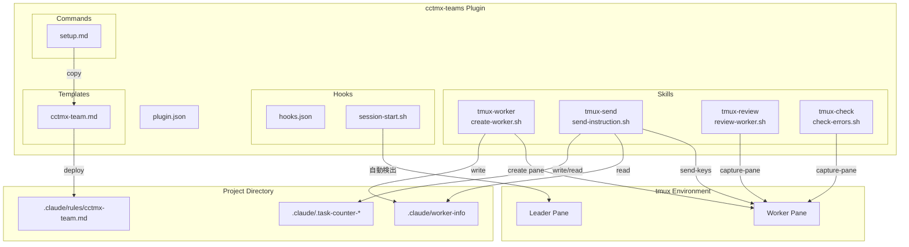
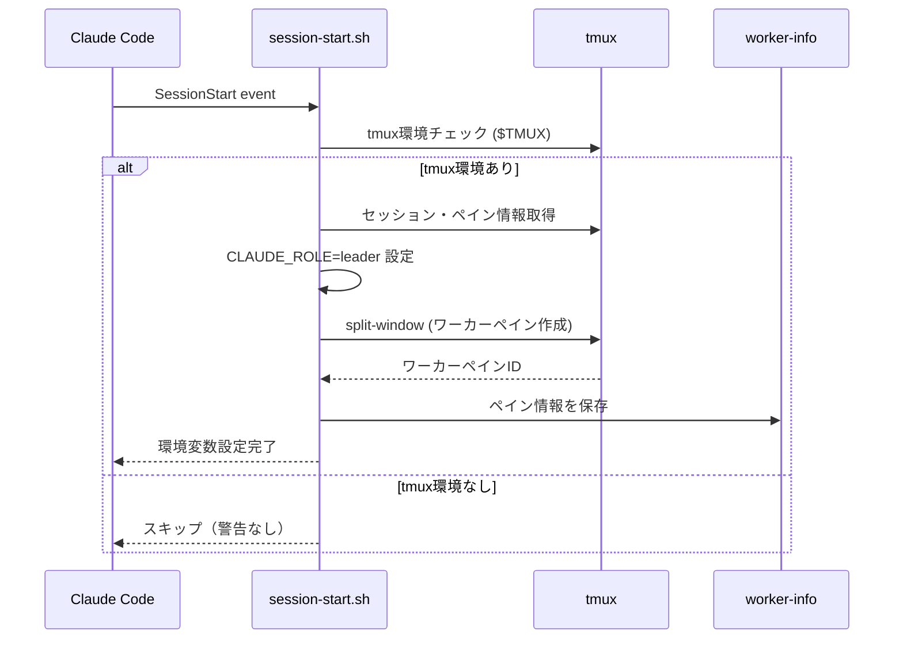
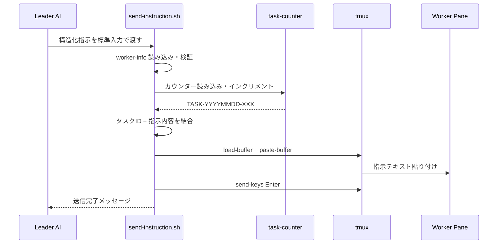

# Design Document: plugin-ification

## Overview

**Purpose**: 既存のプロジェクト固有tmux多重起動実装を、再利用可能なClaude Codeプラグイン `cctmx-teams` v0.1.0 に変換する。

**Users**: Claude Codeでtmuxベースの並列AI開発を行いたい開発者。

**Impact**: プロジェクト固有の実装から汎用プラグインへの変換により、任意のプロジェクトで即座にリーダー・ワーカーパターンを利用可能にする。

### Goals

- 既存の3スキル（tmux-worker, tmux-review, tmux-check）をポータブル化して移行
- 新規スキル（tmux-send）でタスク委譲機能を追加
- setupコマンドでワンステップ導入を実現
- SessionStart Hookで自動環境判定を維持

### Non-Goals

- PreToolUse Hook（ワーカー禁止操作検知）— Phase 2
- Agents（task-decomposer, code-reviewer）— Phase 2以降
- 複数ワーカーサポート — Phase 2以降
- 設定ファイル（`.claude/cctmx-teams.local.md`）— Phase 2以降

## Architecture

### Architecture Pattern & Boundary Map

**Architecture Integration**:
- **Selected pattern**: Claude Codeプラグイン標準構造（Skills + Hooks + Commands + Templates）
- **Domain boundaries**: プラグインコード（読み取り専用）とプロジェクトデータ（読み書き可能）を明確に分離
- **Existing patterns preserved**: tmuxのsend-keys/capture-paneによるプロセス間通信
- **New components rationale**: tmux-sendは構造化指示送信の自動化に必要、setupコマンドは導入体験の簡素化に必要

### Technology Stack

| Layer | Choice / Version | Role in Feature | Notes |
|-------|------------------|-----------------|-------|
| Script Runtime | Bash 4.x+ | 全スクリプト実行 | `set -euo pipefail` |
| Process Management | tmux 3.x+ | ペイン管理、AI間通信 | send-keys, capture-pane |
| Plugin Host | Claude Code | プラグインの読み込み・実行 | 環境変数の自動設定 |
| Quality Tool | shellcheck | 静的解析 | 全警告解消 |

## System Flows

### SessionStart Hook → ワーカー自動作成フロー

### タスク送信フロー (tmux-send)

## Requirements Traceability

| Requirement | Summary | Components | Flows |
|-------------|---------|------------|-------|
| 1 | プラグイン構造 | plugin.json, ディレクトリ構成 | - |
| 2 | ポータブルパス | 全スクリプト | - |
| 3 | 既存Skills移行 | tmux-worker, tmux-review, tmux-check | - |
| 4 | tmux-send新規実装 | tmux-send/send-instruction.sh | タスク送信フロー |
| 5 | setupコマンド | commands/setup.md | - |
| 6 | SessionStart Hook移行 | hooks/session-start.sh | SessionStart フロー |
| 7 | テンプレート移行 | templates/cctmx-team.md | - |

## Components and Interfaces

| Component | Domain/Layer | Intent | Req Coverage | Key Dependencies | Contracts |
|-----------|--------------|--------|--------------|-----------------|-----------|
| plugin.json | Config | プラグインメタデータ定義 | 1 | なし | - |
| create-worker.sh | Skills/tmux | ワーカーペイン作成 | 3 | tmux, worker-info | State |
| review-worker.sh | Skills/tmux | ワーカー出力レビュー | 3 | tmux, SCRATCHPAD_DIR, worker-info | - |
| check-errors.sh | Skills/tmux | エラーパターン検索 | 3 | tmux, worker-info | - |
| send-instruction.sh | Skills/tmux | 構造化指示送信 | 4 | tmux, worker-info, task-counter | State |
| setup.md | Commands | プラグイン初期設定 | 5 | templates/cctmx-team.md | - |
| session-start.sh | Hooks | 自動環境判定 | 6 | tmux, create-worker.sh | State |
| cctmx-team.md | Templates | ガイドテンプレート | 7 | なし | - |

### Skills Layer

#### send-instruction.sh (新規)

| Field | Detail |
|-------|--------|
| Intent | リーダーからワーカーへの構造化指示送信 |
| Requirements | 4 |

**Responsibilities & Constraints**
- ワーカーペイン情報の読み込みと検証
- タスクIDの自動採番（日付ベース）
- tmux load-buffer + paste-buffer による指示テキスト送信
- カウンターファイルの排他的更新

**Dependencies**
- Inbound: Leader AI — 構造化指示テキスト（stdin）
- Outbound: tmux — send-keys/load-buffer/paste-buffer
- External: worker-info — ペイン情報（必須）

##### State Management

- **State model**: カウンターファイル（`.claude/.task-counter-YYYYMMDD`）、ワーカー情報（`.claude/worker-info`）
- **Persistence**: ファイルベース、日付単位でリセット
- **Concurrency**: 単一プロセスでの実行を前提（排他制御なし）

### Hooks Layer

#### session-start.sh (移行)

| Field | Detail |
|-------|--------|
| Intent | Claude Code起動時のtmux環境自動判定と設定 |
| Requirements | 6 |

**Responsibilities & Constraints**
- `$TMUX` 環境変数でtmux環境を判定
- リーダーペインの場合のみワーカーペイン自動作成
- 環境変数（CLAUDE_ROLE, CLAUDE_TMUX_SESSION, CLAUDE_TMUX_PANE）の設定
- タイムアウト10秒以内で完了

**Dependencies**
- Outbound: tmux — セッション情報取得、ペイン作成
- Outbound: worker-info — ペイン情報書き込み

## Error Handling

### Error Strategy

各スクリプトで入力検証を行い、明確な日本語エラーメッセージを標準エラー出力に表示する。

### Error Categories and Responses

**環境エラー**:
- tmux未検出 → "tmux内でClaudeCodeを起動してください"（setup, session-start）
- 環境変数未設定 → "ClaudeCodeを再起動してください"（setup）

**データエラー**:
- worker-info未存在 → "/tmux-worker スキルを先に実行してください"（send, review, check）
- worker-info不正 → "ワーカーペイン情報が不正です"（send, review, check）

**実行エラー**:
- tmuxペイン操作失敗 → 標準エラー出力にエラー内容を表示

## Testing Strategy

### Unit Tests（自動: tests/run-tests.sh）
- プラグイン構造確認（4テスト）
- plugin.json JSON検証（2テスト）
- スクリプト実行権限確認（3テスト）
- 必須ファイル存在確認（15テスト）
- Skills frontmatter検証（4テスト）
- ポータビリティ確認（1テスト）

### Integration Tests（手動: docs/TESTING-GUIDE.md）
- tmuxセッション内でのClaude Code起動
- SessionStart Hook動作確認
- ワーカーペイン自動作成
- 全4スキルの実行
- setupコマンドの実行

### Error Handling Tests（手動）
- tmux外でのスキル実行
- worker-info未存在時のスキル実行
- 存在しないペインへの操作
